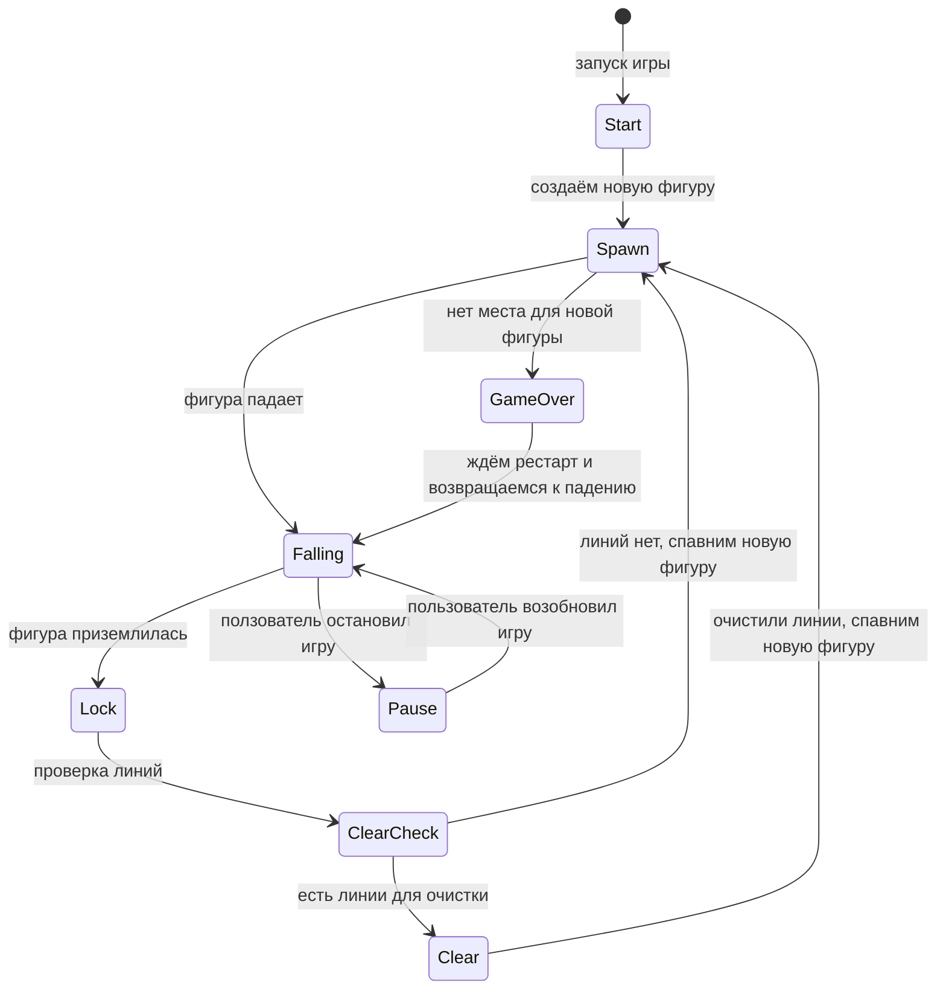

# Проект termfun

Терминальные игры (Tetris и Snake) на языке C++ с использованием `ncurses`, модульной архитектурой и полной поддержкой тестирования и покрытия кода.

---

## Содержание

- [Особенности](#особенности)
- [Требования](#требования)
- [Структура проекта](#структура-проекта)
- [Диаграмма клеточного автомата](#диаграмма-клеточного-автомата)
- [Сборка](#сборка)
- [Запуск игры](#запуск-игры)
- [Тестирование](#тестирование)
- [Покрытие кода](#покрытие-кода)
- [Проверка памяти](#проверка-памяти)
- [Документация](#документация)
- [Дистрибуция](#дистрибуция)
- [Обслуживание](#обслуживание)

---

## Особенности

- Классический Tetris с семью тетромино (`I, O, T, L, J, S, Z`).
- Игра Snake.
- Движение, вращение, жёсткое падение и пауза.
- Отслеживание очков, уровня и рекорда.
- Терминальный интерфейс на `ncurses`.
- Модульная структура: логика игры, интерфейс, ядро и тесты отдельно.
- Полный набор тестов на `Check`.
- Генерация отчётов покрытия с помощью `lcov`/`genhtml`.
- Проверка памяти через `valgrind`.

---

## Требования

- **Компилятор C++:** `g++`
- **Стандарт:** C++20
- **Библиотеки:** `ncurses`, `check`
- **Инструменты:** `make`, `lcov`, `genhtml`, `valgrind` (Linux) или `leaks` (macOS)
- Рекомендуется POSIX-совместимая среда (Linux/macOS)

---

## Структура проекта

```
.
├── Doxyfile
├── Makefile
├── README.md
├── tetris
│   └── main.cpp
├── test
│   └── test.c
└── src
    ├── snake
    │   ├── core
    │   │   ├── brick_game_snake.cpp
    │   │   └── snake.cpp
    │   ├── helpers
    │   │   └── helpers.cpp
    │   └── include
    │       └── s21_snake.h
    ├── tetris
    │   ├── core_files
    │   │   ├── figure
    │   │   │   ├── core
    │   │   │   │   └── s21_figures.c
    │   │   │   └── include
    │   │   │       └── s21_figures.h
    │   │   ├── s21_brickgame_tetris.c
    │   │   ├── s21_check_line.c
    │   │   ├── s21_tetris_logics.c
    │   │   └── s21_tetris_step.c
    │   ├── include
    │   │   ├── s21_tetris_logics.h
    │   │   └── s21_tetris_running.h
    │   └── s21_tetris.h
    ├── tui
    │   ├── core_files
    │   │   ├── s21_tui_tetris.c
    │   │   └── s21_tui_snake.cpp
    │   ├── helpers
    │   │   ├── s21_tetris_input.c
    │   │   └── s21_snake_input.cpp
    │   └── s21_tui.h
    └── vendor
        └── logger
```

---

## Диаграмма клеточного автомата



---

## Сборка

Сборка всего проекта (библиотеки и исполняемый файл):

```bash
make all
```

Компилирует:

- Логику Tetris: `build/s21_tetris_logics_lib.a`
- Логику Snake: `build/s21_snake_lib.a`
- Интерфейс TUI: `build/s21_tui_lib.a`
- Библиотеку для покрытия: `build/s21_tetris_logics_gcov.a`
- Создаёт исполняемый файл `build/termfun`.

Сборка без тестов и документации:

```bash
make install
```

Удаление кеша:

```bash
make uninstall
```

---

## Запуск игры

После сборки:

```bash
./build/termfun
```

Управление (Tetris):

- **Стрелки:** движение
- **Вниз:** мягкое падение
- **Вверх:** вращение
- **Пробел:** жёсткое падение
- **ESC:** пауза
- **Enter:** старт/перезапуск игры
- **Q:** выход

Управление (Snake):

- **Стрелки:** движение
- **Enter:** старт/перезапуск игры
- **Q:** выход

---

## Тестирование

Запуск полного набора тестов:

```bash
make run_test
```

Проверяются инварианты, движения, вращения, жёсткое падение и сценарии.

---

## Покрытие кода

Генерация отчёта покрытия:

```bash
make gcov_report
```

Откройте в браузере:

```
build/coverage_html/index.html
```

---

## Проверка памяти

Проверка утечек и ошибок памяти:

```bash
make valgrind_test
```

- Используется `valgrind` на Linux.
- Используется `leaks` на macOS.

---

## Документация

Создание документации Doxygen:

```bash
make dvi
```

Документация доступна в:

```
build/docs
```

---

## Дистрибуция

Создание архива исходников и тестов:

```bash
make dist
```

Архив находится здесь:

```
build/dist/tetris.tar.gz
```

---

## Обслуживание

- Очистка артефактов сборки:

```bash
make clean
```

- Полная пересборка проекта:

```bash
make rebuild
```
